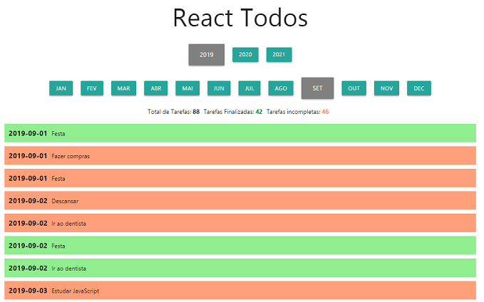

# Lista de Tarefas
Esta aplicação foi desenvovida como requisito para a aprovação no Desafio do Módulo 3 (React) do bootcamp Fullstack Developer do [IGTI](https://igti.com.br).

## Sobre
Trata-se de uma lista de tarefas criada com dados obtidos de uma falsa API REST. Para criar a API falsa, usa-se a dependência chamada [JSON Server](https://github.com/typicode/json-server).

## Instruções
Há duas pastas de nível superior no projeto. A pasta `backend` contém os módulos necessários para criar a API.

Execute os seguintes procedimentos em uma linha de comandos dentro da pasta `backend`:

```bash
yarn
yarn start
```

Depois de executar o backend, acesse a pasta `frontend` em outra janela de linha de comandos e faça o seguinte:

```bash
yarn
yarn start
```

Seu navegador padrão deve abrir e mostrar a interface da aplicação. Clique nos botões de anos e meses para ver as alterações nas listas de tarefas e nas estatísticas.

## Linguagens
- HTML
- CSS
- Javascript

## Bibliotecas e outras dependências de projeto
- [React](https://reactjs.org/)
- [Materialize CSS](https://materializecss.com/)
- [JSON Server](https://github.com/typicode/json-server)

## Screenshots


